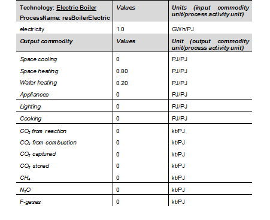

.. _inputs-iocomms:

=================
Commodity Inputs/Outputs
=================

**Input**

Input commodities are the commodities consumed by each
technology.  They are defined in a csv file which describes the commodity inputs to each
technology, calculated per unit of technology activity.

**Output**

Output commodities are the commodities produced by each
technology.  They are defined in a csv file which describes the commodity outputs from
each technology, defined per unit of technology activity. Emissions, such as CO2
(produced from fuel combustion and reactions), CH4, N2O, F-gases, can also be accounted
for in this file.

**General features**

To illustrate the data required for a generic technology in MUSE, the *electric boiler*
technology is used as an example. The commodity flow for the electric boiler, capable
to cover space heating and water heating energy service demands.

   The table below shows the basic data requirements for a typical technology, the
   electric boiler.

Below it is shown the generic structure of the input commodity file for the electric
heater.

.. csv-table:: Commodities used as consumables - Input commodities
   :header: technology, region, year, level, electricity

   resBoilerElectric, region1, 2010, fixed, 300
   resBoilerElectric, region1, 2030, fixed, 290

``technology``
   represents the technology ID and needs to be consistent across all the data inputs.

``region``
   represents the region ID and needs to be consistent across all the data inputs.

``year``
   represents the period of the simulation to which the value applies; it needs to
   contain at least the base year of the simulation.

``level`` (for **input** commodities only)
   characterises inputs as either **fixed** or **flexible**.
   Fixed inputs are always used by a technology in a fixed proportion.
   Flexible inputs allow a technology to choose amongst several alternative fuels,
   depending on which one is cheapest at the time.
   For example, if a vehicle can use either petrodiesel or biodiesel, these
   should be specified as **flexible** inputs, and the technology will choose between
   them based on the price of each.
   If a process has a mix of fixed and flexible inputs, these should be split over two rows.
   Defaults to **fixed**.

Commodities (one column per commodity)
   Any further columns represent commodities, with names matching those
   defined in the global commodities file.
   The values in these columns represent the quantity of the commodity consumed or produced by the technology per unit of activity.
   You do not need to specify all commodities,
   only those that are consumed or produced by the technologies in the sector

--------------------------------

The input data has to be provided for the base year, after which MUSE will assume
that values are constant for all subsequent years, if no further data is provided.
If users wish to vary parameters by year, they can provide rows for additional years.
In this case, MUSE would interpolate the values between the provided periods and assume
a constant value afterwards.
