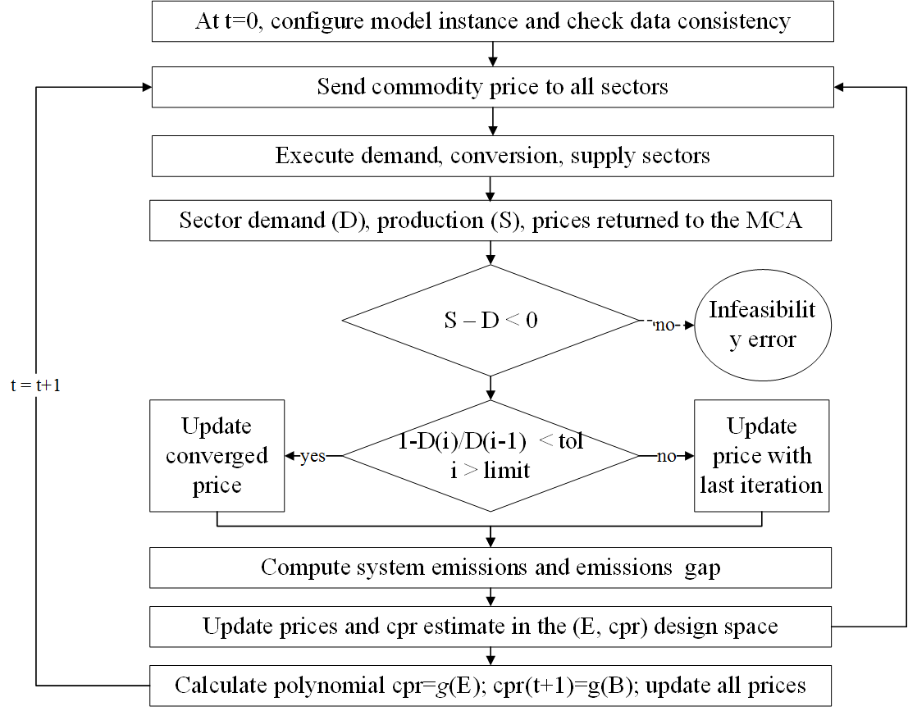

=========================
Market Clearing Algorithm
=========================

In the MUSE modelling framework, the MCA governs the model workflow until the end 
of the simulation. 

The MCA can operate 

* in an "equilibrium" mode when it calculates endogenous prices obtained from each
  commodity equilibrium for all the future periods following the base year
* in a "carbon budget" mode when in addition to each commodity equilibrium price the
  MCA will be calculating an additional global market price for the emissions to meet
  a carbon trajectory
* in an "exogenous" mode, when it uses the initial market projection as the
  projection for the the base year and all the future periods of the simulation

The MCA methodology is conceived to guarantee that the carbon budget 
constraints are met in simulated energy systems where investors have imperfect knowledge 
of future price trajectories. The methodology ensures that:

* the commodity market converges on market-clearing prices, which means that demand and
  supply agree on the price of the commodity exchanged against convergence criteria on
  the relative variation of the demand of each commodity between consecutive iterations.
* the future price trajectory is updated using the concept of imperfect foresight, which
  means that the knowledge of the future prices is available to the investors until a
  configurable number of year (i.e. the foresight period). A flat-forward price
  trajectory is assumed after the foresight period.

The global carbon budget is imposed through an exogenous profile of the systems
emissions over time.  Emission reduction is guaranteed through an endogenously
escalating carbon price. An analytic method is used to the update the carbon price based
on a reduced order model of the system emission dependence with the carbon price. The
number of parameters to fit the polynomial used in the model is chosen to guarantee
robustness while keeping to a minimum the computational burden of the simulation. Being
a simulation model operating with imperfect foresight, in the event that a specific
value of the emissions is larger or lower than the corresponding emissions expected at a
specific simulation time, the emissions offsetting the budget are translated to the next
period.

The iterative procedure is shown in the figure below where:

 * t represents a generic simulated time period
 * D is the commodity demand by time period and region
 * B is the global carbon budget in a period t
 * S is the commodity production by time period and region
 * i corresponds to a generic iteration of the market
 * cpr is the carbon price
 * g represents a polynomial to describe the relationship between emissions and carbon price

