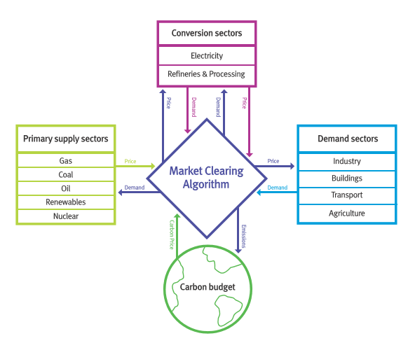

MUSE Overview
=============

How to use MUSE
---------------

There are a huge number of ways that MUSE could be used. The energy field is varied and diverse, and many different scenarios can be explored. Users can model the impact of changes in technology prices, demand, policy instruments, sector interactions and much, much more. People are always thinking of new ways that MUSE can be used. So, get creative!

.. A simulation model of a geographical region or world can be developed and is made up of the following features:

.. #. **Sectors** such as the power sector, gas production sector and the residential sector.

.. #. **Agents** such as a high-income subsection of the population in the UK or a risk-averse generation company. These agents are responsible for making investments in energy technologies.

.. #. **Technologies** which the agents choose to adopt. Technologies either produce an energy commodity (e.g. electricity), or a service demand (e.g. building space heating).

.. #. **Service demands** are demands that must be serviced such as lighting, heating or steel production.

.. #. **Market clearing algorithm** is the algorithm which determines global commodity prices based upon the balancing of supply and demand from each of the sectors. It must be noted, however, that only the conversion and supply sectors are able to modify prices; the demand sectors are price-takers, and so do not modify prices.

.. #. **Equilibrium prices** are the prices determined by the market clearing algorithm and can determine the investments made by agents in various sectors. This allows for the model to project how the system may develop over a time period.

.. These features are described in more detail in the rest of this documentation.

.. What is MUSE?
.. -------------

MUSE is an open source agent-based modelling environment that can be used to simulate change in an energy system over time. An example of the type of question MUSE can help in answering is:

- How may a carbon budget affect investments made in the power sector over the next 30 years?

MUSE can incorporate residential, power, industrial and conversion sectors, meaning many questions can be explored using MUSE, as per the wishes of the user.

MUSE is an agent-based modelling environment, where the agents are investors and consumers. In MUSE, this means that investment decisions are made from the point of view of the investor and consumer. These agents can be heterogeneous, enabling for differering investment strategies between agents, as in the real world.

MUSE is technology rich and can model energy production, conversion and end-use technologies. So, for example, MUSE can enable the user to develop a power sector with solar photovoltaics, wind turbines and gas power plants which produce energy for appliances like electric stoves, heaters and lighting in the residential sector. Agents invest within these sectors, investing in technologies such as electric stoves in the residential sector or gas power plants in the power sectors. The investments made depend on the agent's investment strategies.

Every sector is a user configurable module. This means that a user can configure any number of sectors, containing custom, user-defined technologies and commodities. MUSE is fully data-driven, meaning that the configuration of the model is carried out using a selection of :ref:`input-files`. This means that you are able to customise MUSE to your wishes by modifying these input files. Within a benchmark year, MUSE allows for a user-defined temporal granularity. This allows for the benchmark year to be split into different seasons and times, where energy demand may differ. Thus allowing us to model diurnal peaks in the demand, varying weekly and seasonally.

MUSE is highly configurable, but it has been built with medium and long-term scenarios in mind; for the short-term, MUSE can be linked with more detailed models. As the number of time steps and regions increase, the computational time also increases, which is something to keep in mind when building highly complex models.

.. MUSE differs from the vast majority of energy systems models, which are intertemporal optimisation, by allowing agents to have "limited foresight". This enables these agents to invest under uncertainty of the future, as in the real world. In addition, MUSE is a "partial equilibrium" model, in the sense that it balances supply and demand of each energy commodity in the system.

Most energy systems models are based on cost optimisation and assume that all actors choose the cheapest available options. MUSE, however, uses a simulation framework which allows for the modelling of each sector according to the specific drivers triggering new investments in the sector. Despite the heterogeneity of these sectors, they interact with each other via the partial equilibrium approach which balances supply and demand of each commodity in the energy system.

As opposed to the majority of energy systems models, which assume that investors have full knowledge of future changes in the energy system across decades (intertemporal optimisation), MUSE uses a limited foresight approach. This allows a user to define a configurable number of years over which the investors have knowledge of future commodity prices and demand. This more closely models the real-life case, we believe.

What questions can MUSE answer?
-------------------------------

MUSE allows for users to investigate how an energy system may evolve over a time period, based upon investors using different decision metrics or objectives such as the `net present value <https://en.wikipedia.org/wiki/Net_present_value>`_, `levelized cost of electricity <https://en.wikipedia.org/wiki/Levelized_cost_of_energy>`_ or a custom-defined function. In addition to this, it can simulate how investors search for technology options, and how different objectives are combined to reach an investment decision.

The search for new technologies can depend on several factors such as agents' budgets, technology maturity or preferences on the fuel-type. For instance, an investor in the power sector may decide that they want to focus on renewable energy, whereas another may prefer the perceived most profitable option.

Examples of the questions MUSE can answer include:

- `How may India's steel industry decarbonise? <https://doi.org/10.1016/j.apenergy.2020.115295>`_

- `How might residential consumers change their investment decisions over time? <https://doi.org/10.1016/j.energy.2019.01.161>`_

- How might a carbon tax impact investments made in the power sector?

.. Of course, these are just three examples and the questions that can be answered in the energy field are diverse and varied.

What are MUSE's unique features?
--------------------------------

MUSE is a generalisable agent-based modelling environment and simulates energy transitions from the point of view of the investor and consumer agents. This means that users can define their own agents based upon their needs. The fact that MUSE is an agent-based model means that each of these agents can have different investment behaviours.

Additionally, agent-based models allow for agents to model imperfect information and limited foresight. An example of limited foresight is the ability to model the uncertainty residential users face when predicting the price of gas over the next 25 years. An example of imperfection information is that the technologies that agents invest in are tailored to represent the agents' attitude towards novel technologies and might not include all the technologies available. This is a unique feature to agent-based models when compared to intertemporal optimisation models and more closely models the real world. Many energy systems models are intertemporal optimisation models, which consider the viewpoint of a single benevolent decision maker, with perfect foresight and knowledge. These models optimise energy system investment and operation.

Whilst such intertemporal optimisation models are certainly useful, MUSE is different in that it models the incentives and challenges faced by investors. It can, therefore, be used to investigate different research questions, from the point of view of the investor and consumer. These questions are up to you, so impress us!

MUSE is completely open source, and ready for development.

Visualisation of MUSE
---------------------

The figure above displays the key sectors of MUSE:

- Primary supply sectors; this allows to model diurnal peaks in the demand, varying weekly and seasonally.

- Conversion sectors

- Demand sectors

- Climate model (in the current model this is simplified by the use of a carbon budget.)

- Market clearing algorithm (MCA)

How MUSE works
--------------

MUSE works by iterating between sectors shown above to ensure that energy demands are met by the technologies chosen by the agents. Next, we detail the calculations made by MUSE throughout the simulation.

#. The service demand is calculated. For example, how much electricity, gas and oil demand is there for the energy services of cooking, building space heating and lighting in the residential sector? It must be noted, that this is only known after the energy service demand sector is solved and the technologies invested in are decided.

#. A demand sector is solved. That is, agents choose end-use technologies to serve the demands in the sector. For example, they compare electric stoves to gas stoves to meet the energy service demand of cooking. They then choose between these technologies based upon their:

    i. Search space (which technologies are they willing to consider?)

    ii. Their objectives (which metrics do they consider important?)

    iii. Their decision rules (how do they choose to combine their metrics if they have multiple?)

#. The decisions made by the agents in the demand sectors then leads to a certain level of demand for energy commodities, such as electricity, gas and oil, as a whole. This demand is then passed to the MCA.

#. The MCA then sends these demands to the sectors that supply these energy commodities (supply or conversion sectors).

#. The supply and conversion sectors are solved: agents in these sectors use the same approach (i.e. search space, objectives, decision rules) to decide which technologies to investment in to serve the energy commodity demand. For example, agents in the power sector may decide to invest in solar photovoltaics, wind turbines and gas power plants to service the electricity demand.

#. As a result of these decisions in supply and conversion sectors, a price for each energy commodity is formed. This price is formed based on the levelized cost of energy of the marginal technology. That, the technology which produces the marginal quantity. This price is then passed to the MCA.

#. The MCA then sends these prices back to the demand sectors, which are solved again as above.

#. This process repeats itself until commodity supply and demand converges for each energy commodity for each region. Once these converge, the model has found a “partial equilibrium” on the energy system and it moves forward to the next time period.

Foresight in MUSE
-----------------

Within MUSE, investment decisions are made by the agents. To make these decisions, agents must use their limited knowledge of the future. This allows them to compare investment options under their expectations on prices and demand.

To model this process in MUSE, the agents are given limited foresight. The amount of limited foresight can be set by the user as a set of years. For example, if agents are given 5 years of limited foresight, they have certainty on the exogenous technology costs for the next 5 years. However, their expectations of future demand and prices for the lifetime of the plant, in that moment, are based on a flat-forward extension of the prices from the current period. However these prices can change in the next iteration. In contrast to perfect foresight, where variables such as prices, demand and technology costs in all the future time periods are known from the beginning of the simulation, using the limited foresight period, agents make investments under expectations of the market, which might be wrong.

The figure below details how MUSE runs. Firstly, the initial capacity, price trajectory and demand trajectory are known and set exogenously. These are used to initialize the MCA convergence algorithm. The MCA convergence algorithm finds a suitable set of investments which equilibrate supply and demand. Once equilibrium has been reached, technologies are decided and the commodity prices, which reflect the technology marginal costs. The investments balance asset retirements and the increase in demand, ensuring that supply meets demand.

This whole process repeats itself at every timestep until the specified number of milestone years have run.

.. graphviz::
    :align: center

    digraph foo {
        node [fontname="Helvetica,Arial,sans-serif", shape=box]
        edge [fontname="Helvetica,Arial,sans-serif"]

        inputs [label="Initial capacity,\nprice trajectory &\ndemand trajectory", style=rounded];
        first [label="MUSE module\nt=1", fontsize=20, style=filled, color=lightgrey];
        second [label="MUSE module\nt=2", fontsize=20, style=filled, color=lightgrey];
        repeat [label="... repeat ...", fontsize=20, color=white];
        end [label="Simulated\ntime horizon", style=rounded];
        {node [label="MCA convergence"] mca1; mca2;}
        invFirst [label="Investment based on\ntechnology techno-\neconomics of t=2", color=white]
        invSecond [label="Investment based on\ntechnology techno-\neconomics of t=3", color=white]

        rank=same {inputs -> first -> second -> repeat -> end [penwidth=5]};
        first -> mca1 [label="Marginal cost\n& supply", color=red, fontcolor=red, constraint=false];
        mca1 -> first [label="Price &\n demand", color=blue, fontcolor=blue];
        second -> mca2 [label="Marginal cost\n& supply", color=red, fontcolor=red, constraint=false];
        mca2 -> second [label="Price &\n demand", color=blue, fontcolor=blue];
        first -> invFirst [style=invis]
        second -> invSecond [style=invis]
    }
