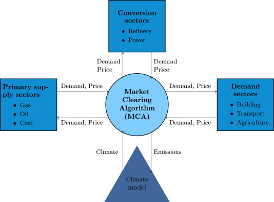

MUSE Overview
=============

.. note::  TODO: Potentially find introductory image to place here.

MUSE is an open source agent-based modelling environment that can be used to simulate change in an energy system over time. An example of the type of question MUSE can help in answering is: how may a carbon budget change investments made in the power sector over the next 30 years? MUSE can incorporate residential, power, industrial and conversion sectors, meaning many questions can be asked, as per the wishes of the user.

MUSE is an agent-based modelling environment, where the agents are investors and consumers. In MUSE, this means that investment decisions are made from the point of view of the investor and consumer. These agents can be heterogenous, enabling for differering investment strategies between agents, as in the real world.

MUSE is technology rich and can model energy production, conversion and end-use technologies. So, for example, MUSE can enable the user to develop a power sector with solar photovoltaics, wind turbines and gas power plants which produce energy for appliances like electric stoves, heaters and lighting in the residential sector. Agents invest within these sectors, investing in technologies such as electric stoves in the residential sector or gas power plants in the power sectors. The investments made depend on their investment strategies.

Every sector is a user configurable module. This means that a user can configure any number of sectors, cointaining custom, user-defined technologies. In practice, this configuration is carried out using a selection of input files. In addition, MUSE can model any geographical region around the world and over any time scale, from a single year through to 100 years or more. Within a year, MUSE allows for a user-defined temporal granularity. This allows for the year to be split into different seasons and times, where energy demand may differ.

MUSE differs from the vast majority of energy systems models, which are intertemporal optimisation, by allowing agents to use "limited foresight". This enables these agents to invest under uncertainty of the future, as in the real world. In addition, MUSE is a "partial equilibrium" model, in the sense that it balances supply and demand of each energy commodity in the system.

What questions can MUSE answer?
-------------------------------

MUSE allows for users to investigate how an energy system may evolve over a time period, based upon investors using different decision metrics or objectives such as the net present value, levelized cost of electricity or a custom-defined function. In addition to this, it can simulate how investors search for technology options, and how different objectives are combined to reach an investment decision. The search for new technologies can depend on several factors such as agents' budgets, technology mutirty and preferences on the fuel-type. For instance, an investor in the power sector may decide that they want to focus on renewable energy, whereas another may prefer the perceived most profitable option.

Examples of the questions MUSE can answer include:

- `How may India's steel industry decarbonise? <https://www.sciencedirect.com/science/article/pii/S0306261920308072>`_

- `How might residential consumers change their investment decisions over time? <https://www.sciencedirect.com/science/article/pii/S036054421930177X>`_

- How might a carbon tax impact investments made in the power sector?

.. Of course, these are just three examples and the questions that can be answered in the energy field are diverse and varied. 

How to use MUSE
---------------

There are a huge number of potential ways that MUSE can be used. The energy field is varied and diverse, and many different scenarios can be explored. Users can model the impact of changes in technology prices, demand, policy instruments, sector interactions nad much, much more. People are always thinking of new ways that MUSE can be used. So, get creative!

A simulation model of a geographical region or world can be developed and is made up of the following features:

#. **Sectors** such as the power sector, gas production sector and the residential sector.

#. **Agents** such as a high-income subsection of the population in the UK or a risk-averse generation company. These agents are responsible for making investments in energy technologies.

#. **Technologies** which the agents choose to adopt. Technologies either produce an energy commodity (e.g. electriicty), or a service demand (e.g. building space heating).

#. **Service demands** are demands that must be serviced such as lighting, heating or steel production.

#. **Market clearing algorithm** is the algorithm which determines global commodity prices based upon the balancing of supply and demand from each of the sectors. 

#. **Equilibrium prices** are the prices determined by the market clearing algorithm and can determine the investments made by agents in various sectors. This allows for the model to project how the system may develop over a time period. 

These features are described in more detail in the rest of this documentation.

What are MUSE's unique features?
--------------------------------

MUSE is a generalisable agent-based modelling environment and simulates energy transitions from the point of view of the investor and consumer agents. This means that users can define their own agents based upon their needs. The fact that MUSE is an agent-based model means that each of these agents can have different investment behaviours. 

Additionally, agent-based models allow for agents to model imperfect information and limited foresight. An example of this is the inability for residential users to know the price of gas over the next 25 years. This is a unique feature to agent-based models when compared to intertemporal optimisation models and more closely models the real world. Many energy systems models are intertemporal optimisation models, which consider the viewpoint of a single benevolent decision maker, with perfect foresight and knowledge. These models optimise energy system investment and operation.

Whilst such intertemporal optimisation models are certainly useful, MUSE is different in that it models the incentives and challenges faced by investors. It can, therefore, be used to investigate different research questions, from the point of view of the investor and consumer. These questions are up to you, the user, so impress us!

MUSE is completely open source, and ready for development.

Visualisation of MUSE 
---------------------

The figure above displays the key sectors of MUSE:

- Primary supply sectors

- Conversion sectors

- Demand sectors

- Climate model

- Market clearing algorithm (MCA)

How MUSE works
--------------

* The energy service demand is calculated. For example, how much demand is there for cooking, building space heating and lighting in the residential sector?

* A demand sector is solved. That is, agents choose end-use technologies to serve the demands in the sector. For example, electric stoves are compared to gas stoves to meet demand for cooking. These technologies are chosen based upon their:
    #. Search space (which technologies are they happy to consider).

    #. Their objectives (i.e. metrics they consider important).

    #. Their decision rules (which ways do they choose to combine their metrics if they have multiple?).

* This leads to a certain level of demand for energy commodities by the sector as a whole, which is then passed to the MCA.

* The MCA then sends these demands to the sectors that supply the commodities (supply or conversion sectors).

* The supply and conversion sectors are solved: agents in these sectors use the same approach (i.e. search space, objectives, decision rules) to decide which technologies to investment in to serve the energy commodity demand. 

* As a result of these decisions a price for each energy commodity is formed. This is passed to the MCA.

* The MCA then sends these prices back to the demand sectors, which are solved again as above.

* This process repeats itself until commodity supply and demand converges for each energy commodity. Once these converge, the model has found a “partial equilibrium” and it moves forward to the next time period.

